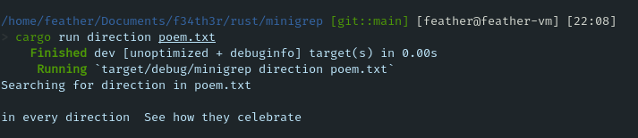

# MiniGREP

Is an example of the popular tool `grep`.



## How to run it

### For normal use:

```bash
cargo run [word] [path]
```

### This mini CLI have one env options, is `CASE_INSENSITIVE`.

How to use it?

```bash
export CASE_INSENSITIVE=true
```

and for turn of:

```bash
unset CASE_INSENSITIVE
```

### In an output

```bash
cargo run [word] [path] > output.txt
```
